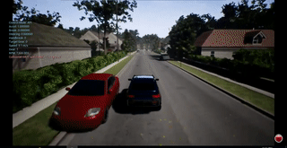

# Distributed Deep Reinforcement Learning  for Autonomous Driving

### Authors:

**[Mitchell Spryn](https://www.linkedin.com/in/mitchell-spryn-57834545/)**, Software Engineer II, Microsoft

**[Aditya Sharma](https://www.linkedin.com/in/adityasharmacmu/)**, Program Manager, Microsoft

**[Dhawal Parkar](https://www.linkedin.com/in/dparkar/)**, Software Engineer II, Microsoft

## Overview

In this tutorial, you will learn how to train a distributed deep reinforcement learning model for autonomous driving leveraging the power of cloud computing. This tutorial serves as an introduction to training deep learning AD models at scale. Through the course of this tutorial you will learn how to set up a cluster of virtual machine nodes running the [AirSim simulation environment](https://github.com/Microsoft/AirSim) and then distribute a training job across the nodes to train a model to steer a car through the Neighborhood environment in AirSim using reinforcement learning. A visualization of this process on four such VM nodes can be seen below. 

The instructions provided here use virtual machines spun up on [Microsoft Azure](https://azure.microsoft.com/en-us/) using the [Azure Batch](https://azure.microsoft.com/en-us/services/batch/) service to schedule the distribution job. The ideas presented however, can be easily extended to the cloud platform and services of your choice. Please also note that you should be able to work through the tutorial without having to actually run the given code and train the model. **If you do wish to run the code, you will need an active [Azure subscription](https://azure.microsoft.com/en-us/free/), and kicking off the training job will [incur charges](https://azure.microsoft.com/en-us/pricing/).** 

#### Who is this tutorial for?

This tutorial was designed keeping autonomous driving practitioners in mind. Researchers as well as industry professionals working in the field will find this tutorial to be a good starting off point for further work. The focus of the tutorial is on teaching how to create autonomous driving models at scale from simulation data. While we use deep reinforcement learning to demonstrate how to train such models and the tutorial does go into model discussions, it assumes that readers are familiar with the mechanics of reinforcement learning. Beginners in the field, especially those who are new to deep learning, might find certain aspects of this tutorial challenging. Please refer to the Prerequisites section below for more details.

## Prerequisites and setup

#### Background needed

This tutorial was designed with advanced users and practitioners in mind, hence it assumes the reader has a background in deep learning, and is familiar with the basic concepts of reinforcement learning (reward functions, episodes etc.). A helpful introduction to reinforcement learning can be found [here](https://medium.freecodecamp.org/deep-reinforcement-learning-where-to-start-291fb0058c01).

It is also highly recommended that the reader has familiarity with the AirSim simulation platform. This tutorial builds upon certain concepts introduced in our [end-to-end deep learning for autonomous driving](../AirSimE2EDeepLearning/README.md) tutorial. We therefore recommend going through that tutorial first.

#### Environment Setup

1. [Install Anaconda](https://conda.io/docs/user-guide/install/index.html) with Python 3.5 or higher.
2. [Install Tensorflow](https://www.tensorflow.org/install/install_windows)
3. [Install h5py](http://docs.h5py.org/en/latest/build.html)
4. [Install Keras](https://keras.io/#installation)
5. [Install AzCopy](https://docs.microsoft.com/en-us/azure/storage/common/storage-use-azcopy). Be sure to add the location for the AzCopy executable to your system path.
6. [Install the latest verison of Azure Powershell](https://docs.microsoft.com/en-us/powershell/azure/install-azurerm-ps?view=azurermps-5.3.0).
7. [Install the latest version of the Azure CLI](https://docs.microsoft.com/en-us/cli/azure/install-azure-cli?view=azure-cli-latest).
8. Install the other dependencies. From your anaconda environment, run "InstallPackages.py" as root or administrator. This installs the following packages into your environment:
    * jupyter
    * matplotlib v. 2.1.2
    * image
    * keras_tqdm
    * opencv
    * msgpack-rpc-python
    * pandas
    * numpy
    * scipy

#### Simulator Package

We have created a standalone build of the AirSim simulation environment for the tutorials in this cookbook. [You can download the build package from here](https://airsimtutorialdataset.blob.core.windows.net/e2edl/AD_Cookbook_AirSim.7z). Consider using [AzCopy](https://docs.microsoft.com/en-us/azure/storage/common/storage-use-azcopy), as the file size is large. After downloading the package, unzip it and run the PowerShell command

`
.\AD_Cookbook_Start_AirSim.ps1 neighborhood
`

to start the simulator in the neighborhood environment.

#### Hardware

This tutorial has been designed to run on Azure Batch using NV6 machines. Training times and charges vary depending on the number of machines that are spun up. Using a cluster size of 4 (i.e. 3 agent nodes and 1 parameter server node), the model took 3 days to train from scratch. Using transfer learning, the model trained in 6 hours. Using a large cluster size will result in a decreased training time, but will also incur additional charges. 

For demonstration purposes, the model can also be trained on a single machine (see instructions below). The model can take up to 5 days to train from scratch, but can train in a few hours using transfer learning. To train the model locally, a machine with a GPU is required.

Running the final trained model requires a GPU. This can either be a local machine, or an NV-Series [Azure Data Science VM](https://azure.microsoft.com/en-us/services/virtual-machines/data-science-virtual-machines/). 

## Structure of the tutorial

You will follow a series of [Jupyter notebooks](https://jupyter-notebook.readthedocs.io/en/stable/index.html) as you make your way through this tutorial. Please start with the [first notebook to set up your cluster](SetupCluster.ipynb) and proceed through the notebooks in the following order:

Step 0: [Set up the cluster](SetupCluster.ipynb)

Step 1: [Explore the algorithm](ExploreAlgorithm.ipynb)

Step 2: [Launch the training job](LaunchTrainingJob.ipynb)

Step 3: [Run the model](RunModel.ipynb)

If you wish to train the model locally, proceed through the notebooks in the following order:

Step 1: [Explore the algorithm](ExploreAlgorithm.ipynb)

Step 2A: [Launch the local training job](LaunchLocalTrainingJob.ipynb)

Step 3: [Run the model](RunModel.ipynb)
